# Dokumentacja MiniERP

# 1. Wstęp

MiniERP - uproszczony system ERP. Projekt wykonywany w ramach miesięcznych praktyk w firmie TOP S.A

### 1.1. Opis projektu

Celem projektu było utworzenie webowego systemu ERP dla małej lub średniej firmy handlowej. Łączy on moduły klientów, dostawców, produktów, magazynu, sprzedaży, zakupów oraz raportowania w jeden spójny system.

### 1.2. Zastosowany stos technologiczny
| Warstwa | Technologie |
| :--- | :--- |
| Backend | Java 21, Spring boot 4.1, Gradle, Spring Security 7 (JWT), Spring Data JPA / Hibernate, Lombok, Bean Validation  |
| Baza danych | PostgreSQL 17, migracje Flyway |
| Frontend | React 19, TypeScript, Vite, React Router v7, TanStack Query v5, TanStack Table v8, React Hook Form + Zod, Tailwind CSS, Recharts |
| Dokumentacja API | Swagger / OpenApi|
| Konteneryzacja | Docker, Docker compose |

# 2. Moduły funkcjonalne

Poniższa sekcja zawiera dokładny opis funkcjonalności, które zostały wykonane w ramach danego modułu.

## 2.1. Uwierzetylnianie

Logowanie wydaje krótki access token JWT (15 min), zwracany w odpowiedzi, oraz refresh token (7 dni), zapisywany w cookie httpOnly. Gdy access token wygaśnie frontend wywołuje odświeżanie i ponawia żądanie.

| Metoda | Ścieżka | Opis | Uprawnienie
| :--- | :--- | :--- | :--- |
| POST | `/auth/login` | logowanie: login + hasło -> access token, refresh w cookie | publiczny |
| POST | `auth/refresh` | nowy access token na podstawie cookie | publiczny |
| POST | `auth/logout` | unieważnienie cookie refresh | publiczny |   

## 2.2. Moduł DASHBOARD

Pulpit startowy pokazuje w jednym widoku stan firmy. Dane pochodz a z jednego zbiorczego endpointu, by pulpit ładował się jednym zapytaniem.

| Metoda | Ścieżka | Opis | Uprawnienie
| :--- | :--- | :--- | :--- |
| GET | `/dashboard/summary` | liczniki i wartości na pulpit | zalogowany |

Moduł zawiera:

- Wyświetlanie skróconych ogólnych informacji o danych w systemie (liczba klientów, liczba produktów, liczba aktywnych zamówień, wartość sprzedaży, wartość zakupów, wartość magazynu, lista produktów z niskim stanem)
- Powiadomienia o niskim stanie wyświetlane na pulpicie
- Podstawowy wykres sprzedaży

## 2.3. Moduł KLIENT

Klient ma dane podstawowe (nazwa, NIP, e-mail) oraz dwa rodzaje adresów: płatnika (na fakturę) i odbiorcy (dokąd dostarczyć towar, telefon). Każdy rodzaj może mieć wiele adresów z których jeden jest domyślny.

| Metoda | Ścieżka | Opis | Uprawnienie |
| :--- | :--- | :--- | :--- |
| `GET` | `/customers?search=&active=` | lista klientów | `CLIENT_READ` |
| `GET` | `/customers/{id}` | szczegóły klienta | `CLIENT_READ` |
| `POST` | `/customers` | nowy klient z adresami | `CLIENT_WRITE` |
| `PUT` | `/customers/{id}` | edycja nazwy, NIP, e-maila | `CLIENT_WRITE` |
| `DELETE` | `/customers/{id}` | dezaktywacja | `CLIENT_WRITE` |
| `PATCH` | `/customers/{id}/activate` | aktywacja | `CLIENT_WRITE` |
| `GET` | `/customers/{id}/payer-addresses` | aktywne adresy płatnika | `CLIENT_READ` |
| `POST` | `/customers/{id}/payer-addresses` | nowy adres płatnika | `CLIENT_WRITE` |
| `PUT` | `/customers/{id}/payer-addresses/{addressId}` | edycja (nowa wersja adresu) | `CLIENT_WRITE` |
| `DELETE` | `/customers/{id}/payer-addresses/{addressId}` | usunięcie (soft delete) | `CLIENT_WRITE` |
| `PATCH` | `/customers/{id}/default-payer/{addressId}` | ustawienie domyślnego płatnika | `CLIENT_WRITE` |
| `GET` | `/customers/{id}/receiver-addresses` | aktywne adresy odbiorcy | `CLIENT_READ` |
| `POST` | `/customers/{id}/receiver-addresses` | nowy adres odbiorcy | `CLIENT_WRITE` |
| `PUT` | `/customers/{id}/receiver-addresses/{addressId}` | edycja (nowa wersja adresu) | `CLIENT_WRITE` |
| `DELETE` | `/customers/{id}/receiver-addresses/{addressId}` | usunięcie (soft delete) | `CLIENT_WRITE` |
| `PATCH` | `/customers/{id}/default-receiver/{addressId}` | ustawienie domyślnego odbiorcy | `CLIENT_WRITE` |

Historia zamówie klienta korzysta z listy zamówień sprzedażowych z filtrem `customerId`

## 2.4. Moduł DOSTAWCA

Dostawca ma dane firmy, kontakt i jeden adres siedziby.

Widoki to lista, formularz, szczegóły z edycją i hisorią zamówień zakupowych dostawcy.

| Metoda | Ścieżka | Opis | Uprawnienie |
| :--- | :--- | :--- | :--- |
| `GET` | `/suppliers?search=&active=` | lista dostawców | `SUPPLIER_READ` |
| `GET` | `/suppliers/{id}` | szczegóły | `SUPPLIER_READ` |
| `POST` | `/suppliers` | nowy dostawca | `SUPPLIER_WRIT` |
| `PUT` | `/suppliers/{id}` | edycja | `SUPPLIER_WRIT` |
| `DELETE` | `/suppliers/{id}` | dezaktywacja | `SUPPLIER_WRIT` |
| `PATCH` | `/suppliers/{id}/activate` | aktywacja | `SUPPLIER_WRIT` |

## 2.5. Moduł PRODUKT

Produkt to towar w konkretnym magazynie. Ten sam towar w dwóch magazynach to dwa wiersze z tym samym SKU (unikalność `(sku, warehouse_id)`). Produkt ma kategorię, ceny zakupu i sprzedaży, stawkę VAT (enum), jednostkę miary i minimalny stan.

Widoki to lista (wyszukiwanie, filtrowaie, wyróżnienie niskiego stanu), formularz, szczegóły z modalem edycji, tabla historii cen, formularz kategorii

| Metoda | Ścieżka | Opis | Uprawnienie |
| :--- | :--- | :--- | :--- |
| `GET` | `/products?search=&active=&categoryId=&warehouseId=` | lista produktów | `PRODUCT_READ` |
| `GET` | `/products/{id}` | szczegóły | `PRODUCT_READ` |
| `GET` | `/products/{id}/price-history` | historia zmian cen | `PRODUCT_READ` |
| `POST` | `/products` | nowy produkt | `PRODUCT_WRITE` |
| `PUT` | `/products/{id}` | edycja danych katalogowych | `PRODUCT_WRITE` |
| `DELETE` | `/products/{id}` | dezaktywacja | `PRODUCT_WRITE` |
| `PATCH` | `/products/{id}/activate` | aktywacja | `PRODUCT_WRITE` |
| `GET` | `/categories?active=` | lista kategorii | `PRODUCT_READ` |
| `POST` | `/categories` | nowa kategoria (unikalna nazwa) | `PRODUCT_WRITE` |
| `PUT` | `/categories/{id}` | zmiana nazwy | `PRODUCT_WRITE` |
| `DELETE` | `/categories/{id}` | dezaktywacja | `PRODUCT_WRITE` |


## 2.6. Moduł MAGAZYN

Magazyny to słownik miejsca składowania. Operacje magazynowe zmieniają `stock` w wierszu produktu i każda z nim zapisuje ruch magazynowy

Operacje:

- przyjęcie: wiele pozycji w jednej operacji, stan +
- wydanie: wiele pozycji w jednej operacji, stan − 
Operacja jest odrzucana, jeśli którakolwiek pozycja zeszłaby poniżej zera (cała operacja w jednej transakcji)
- przesunięcie: jeden produkt do innego magazynu. Jeśli w magazynie docelowym nie ma towaru o tym SKU, system zakłada nowy wiersz produktu (kopia danych katalogowych), w przeciwnym razie zwiększa istniejący stan
- niskie stany: widok SQL low_stock_products (stan <= minimum), opcjonalnie dla jednego magazynu.

Magazynu nie można dezaktywować, dopóki są w nim aktywne produkty.

Widoki to lista magazynów, formularz, szczegóły z produktami magazynu, strony przyjęcia, wydania i przesunięcia.

| Metoda | Ścieżka | Opis | Uprawnienie |
| :--- | :--- | :--- | :--- |
| `GET` | `/warehouses?search=&active=` | lista magazynów | `WAREHOUSE_READ` |
| `GET` | `/warehouses/{id}` | szczegóły | `WAREHOUSE_READ` |
| `POST` | `/warehouses` | nowy magazyn | `WAREHOUSE_MANAGE` |
| `PUT` | `/warehouses/{id}` | edycja | `WAREHOUSE_MANAGE` |
| `DELETE` | `/warehouses/{id}` | dezaktywacja | `WAREHOUSE_MANAGE` |
| `GET` | `/warehouses/low-stock?warehouseId=` | produkty poniżej minimum | `WAREHOUSE_READ` |
| `POST` | `/products/receive` | przyjęcie (lista {productId, quantity}) | `WAREHOUSE_OPERATE` |
| `POST` | `/products/issue` | wydanie (lista {productId, quantity}) | `WAREHOUSE_OPERATE` |
| `POST` | `/products/{id}/transfer` | przesunięcie (quantity, targetWarehouseId) | `WAREHOUSE_OPERATE` |

## 2.7. Moduł RUCHY MAGAZYNOWE

Dziennik wszystkich zmian stanu. Każdy ruch zapisuje typ (`PRZYJECIE`, `WYDANIE`, `PRZESUNIECIE`), produkt, magazyn, ilość wykonującego i datę. Nazwy produktu i magazynów są zapisywane jako snapshot z chwili ruchu więc późniejsza zmiana nazwy nie zmienia historii.

Pola `source_type` i `source_id` wskazują źródło ruchu np. `SALES_ORDER` z numerem zamówienia (wydanie przy realizacji, zwrot przy anulowaniu) albo `PURCHASE_ORDER` (przyjęcie dostawy). Puste pola oznaczają operację ręczną.

Widok to taela ruchów z filtrami (magazyn, typ, zakres dat)

| Metoda | Ścieżka | Opis | Uprawnienie |
| :--- | :--- | :--- | :--- |
| `GET` | `/stock-movements?productId=&warehouseId=&type=&from=&to=` | historia ruchów | `WAREHOUSE_READ` |

## 2.8. Moduł SPRZEDAŻ

Zamówienie sprzedażowe tworzy się dla klienta, z wyborem jednego z jego aktywnych adresów dostawy. Pozycje zapisują snapshot produktu czyli SKU, nazwę, cene sprzedaży, cene zakupu (do marży) i stawkę VAT. Sumy netto, VAT i brutto liczy backend i zapisuje je w nagłówku zamówienia.

Cykl życia (przejścia kontroluje backend)

```text
NEW ───► CONFIRMED ───► PROCESSING ───► READY ───► COMPLETED
 │            │              │            │
 └────────────┴──────────────┴────────────┴──────► CANCELLED
 ```

Każda zmiana statusu, w tym utworzenie, zapisuje się w historii statusów zamówienia (kto, kiedy, z jakiego na jaki status). Sczegóły zamówienia pokazują ją jako oś czasu.

Widoki to lista (filtru statusu i dat), formularz (autocomplete klienta i produktów, wybór adresu dostawy), szczegóły z przyciskami zmiany statusu, pozycjami, podsumowaniem i historią statusów.

| Metoda | Ścieżka | Opis | Uprawnienie |
| :--- | :--- | :--- | :--- |
| `GET` | `/sales-orders?customerId=&status=&from=&to=` | lista zamówień | `SALES_READ` |
| `GET` | `/sales-orders/{id}` | nagłówek zamówienia | `SALES_READ` |
| `GET` | `/sales-orders/{id}/items` | pozycje | `SALES_READ` |
| `GET` | `/sales-orders/{id}/history` | historia statusów | `SALES_READ` |
| `POST` | `/sales-orders` | nowe zamówienie | `SALES_WRITE` |
| `POST` | `/sales-orders/{id}/confirm` | → CONFIRMED | `SALES_WRITE` |
| `POST` | `/sales-orders/{id}/process` | → PROCESSING (wydanie) | `SALES_WRITE` |
| `POST` | `/sales-orders/{id}/ready` | → READY | `SALES_WRITE` |
| `POST` | `/sales-orders/{id}/complete` | → COMPLETED | `SALES_WRITE` |
| `POST` | `/sales-orders/{id}/cancel` | → CANCELLED (ew. zwrot) | `SALES_WRITE` |

## 2.9. Moduł ZAKUPY

Zamówienie do dostawcy ma jeden magazyn docelowy czyli jedno zamówienie -> jedna dostawa do jednego magazynu. Pozycje mogą zawierać wyłącznie produkty z tego magazynu, co backend sprawdza przy tworzeniu. Pozycje zapisują snapshot SKU, nazwy, ceny zakupu i VAT

Cykl życia:

```text
NEW → ORDERED → RECEIVED
  └──────┴──→ CANCELLED
```

Historia statusów działa tak samo jak w sprzedaży.

Widoki to lista, formularz (autocomplete dostawcy, wybór magazynu, produkty filtrowane do magazynu, szczegóły z przyciskami statusów i historią)

| Metoda | Ścieżka | Opis | Uprawnienie |
| :--- | :--- | :--- | :--- |
| `GET` | `/purchase-orders?supplierId=&status=&from=&to=` | lista zamówień | `PURCHASE_READ` |
| `GET` | `/purchase-orders/{id}` | nagłówek | `PURCHASE_READ` |
| `GET` | `/purchase-orders/{id}/items` | pozycje | `PURCHASE_READ` |
| `GET` | `/purchase-orders/{id}/history` | historia statusów | `PURCHASE_READ` |
| `POST` | `/purchase-orders` | nowe zamówienie | `PURCHASE_WRITE` |
| `POST` | `/purchase-orders/{id}/order` | → ORDERED | `PURCHASE_WRITE` |
| `POST` | `/purchase-orders/{id}/receive` | → RECEIVED (przyjęcie) | `PURCHASE_WRITE` |
| `POST` | `/purchase-orders/{id}/cancel` | → CANCELLED | `PURCHASE_WRITE` |

## 2.10. Moduł RAPORT

Jeden widok z zakładkami: Sprzedaż, Zakupy, Marża, Magazyn, Rankingi. Raporty okresowe mają filtr zakresu dat i zapytanie wysyłane przyciskiem „Filtruj".
Raporty sprzedaży i zakupów mają też granulację (dzień, tydzień, miesiąc) i wykres słupkowy.

- Sprzedaż w czasie
- Zakupy w czasie
- Najlepiej sprzedające się produkty i najaktywniejsi klienci
- Marża
- Stany magazynowe, wartość magazynu (osobno dla każdego), produkty poniżej minimum

| Metoda | Ścieżka | Parametry | Uprawnienie |
| :--- | :--- | :--- | :--- |
| `GET` | `/reports/sales` | `from`, `to`, `granularity=day\|week\|month` | `REPORT_READ` |
| `GET` | `/reports/purchases` | `from`, `to`, `granularity` | `REPORT_READ` |
| `GET` | `/reports/top-products` | `from`, `to` | `REPORT_READ` |
| `GET` | `/reports/top-customers` | `from`, `to` | `REPORT_READ` |
| `GET` | `/reports/margin` | `from`, `to` | `REPORT_READ` |
| `GET` | `/reports/stock-levels` | — | `REPORT_READ` |
| `GET` | `/reports/warehouse-value` | — (wartość per magazyn) | `REPORT_READ` |
| `GET` | `/reports/below-minimum` | — | `REPORT_READ` |


# 2.11. Moduł AUDIT LOG

Centralny log operacji w systmie. Wpis zawiera użytkownika, czas, akcję (np. `LOGIN_SUCCESS, LOGIN_FAILED, CREATE, UPDATE, ACTIVATE, DEACTIVATE, STATUS_CHANGE, STOCK_MOVEMENT`), typ encji i jej id oraz opis. Przy edycjach zapisywany jest też JSON z przesłanymi danymi, żeby było widać, co zmieniono. Serializowany jest DTO żądania, a nie encja, więc do logu nie trafiają pola wewnętrzne.

Zapis do dziennika jest wywoływane jawnie w serwisach. Historia statusów zamówień i ruchy magazynowe mają własne, szczegółowe tabele. Dziennik zawiera o nich tylko krótką informację.

| Metoda | Ścieżka | Parametry | Uprawnienie |
| :--- | :--- | :--- | :--- |
| `GET` | `/audit` | `action, entityType, from, to (daty yyyy-MM-dd)` | `AUDIT_READ` |

# 2.12. Moduł UŻYTKOWNIK

Zarządzanie kontami jest dostępne tylko dla administratora. Rola jest encją w bazie (ADMIN, MANAGER, USER) i przypisuje się ją po nazwie.

Zasady bezpieczeństwa:
- hashowane hasła (BCrypt)
- osobne DTO dla każdej operacji: tworzenie (z hasłem), edycja (imię i rola, bez hasła), reset hasła (tylko hasło), odpowiedź (bez hasła). Edycja fizycznie nie może zmienić hasła, a odpowiedź nie może zawierać hasha
- administrator nie może dezaktywować własnego konta
- login normalizowany do mały liter bez spacji

Widoki to lista z avatarami (inicjały), znacznikami ról i statusem, modale tworzenia, edycji roli i resetu hasła.

| Metoda | Ścieżka | Opis | Uprawnienie |
| :--- | :--- | :--- | :--- |
| `GET` | `/users` | lista użytkowników | `USER_MANAGE` |
| `POST` | `/users` | nowe konto | `USER_MANAGE` |
| `PUT` | `/users/{id}` | edycja imienia i roli | `USER_MANAGE` |
| `PATCH` | `/users/{id}/password` | reset hasła | `USER_MANAGE` |
| `PATCH` | `/users/{id}/activate` | aktywacja | `USER_MANAGE` |
| `DELETE` | `/users/{id}` | dezaktywacja | `USER_MANAGE` |


## 3. Interfejs (z konta Administratora)

## 3.1. Logowanie

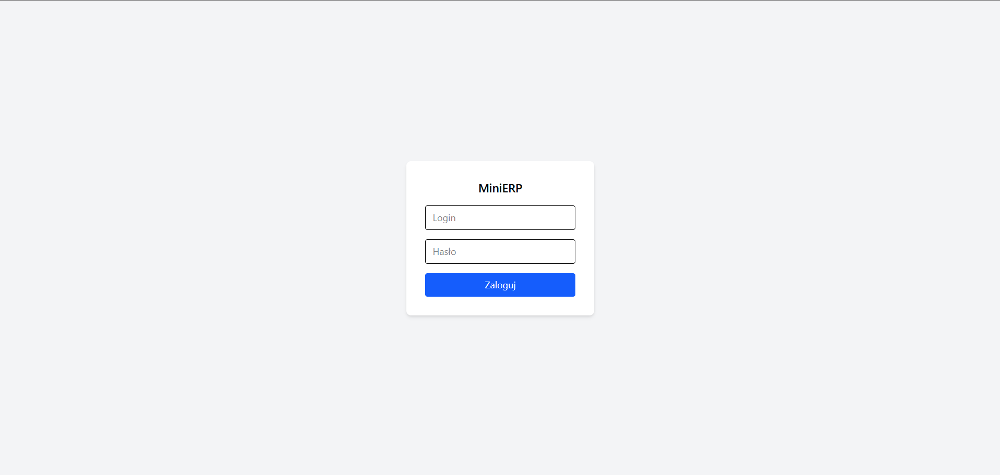

## 3.2. Dashboard

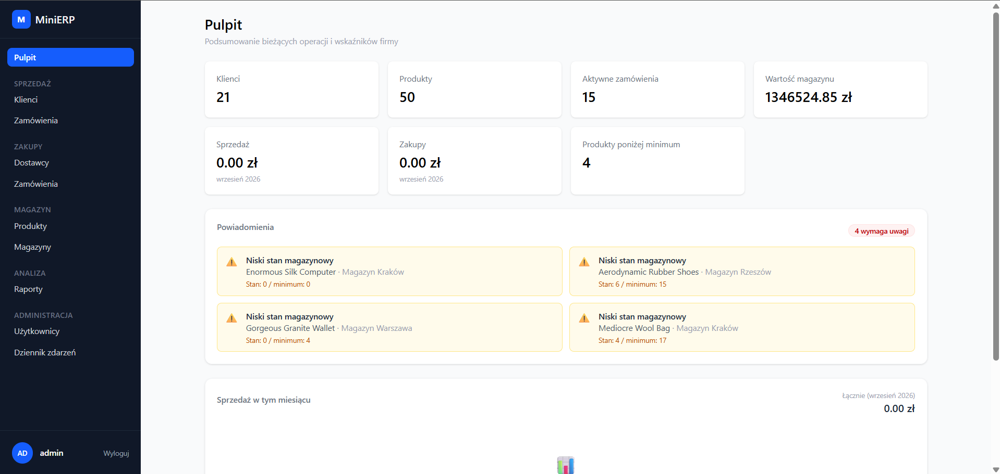

## 3.3. Sprzedaż

Dane seedowane

### Lista klientów
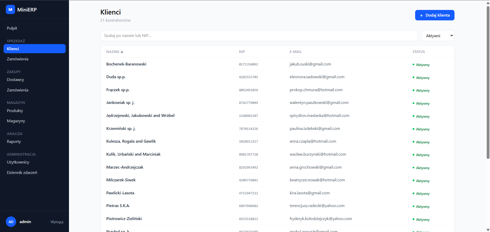

### Zamówienia klientów
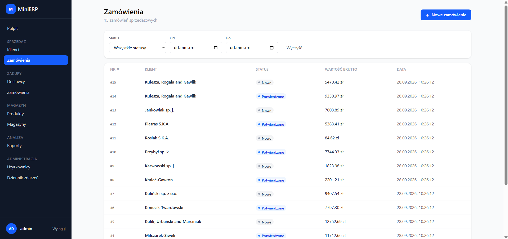

### Forumlarz dodawnia zamówienia
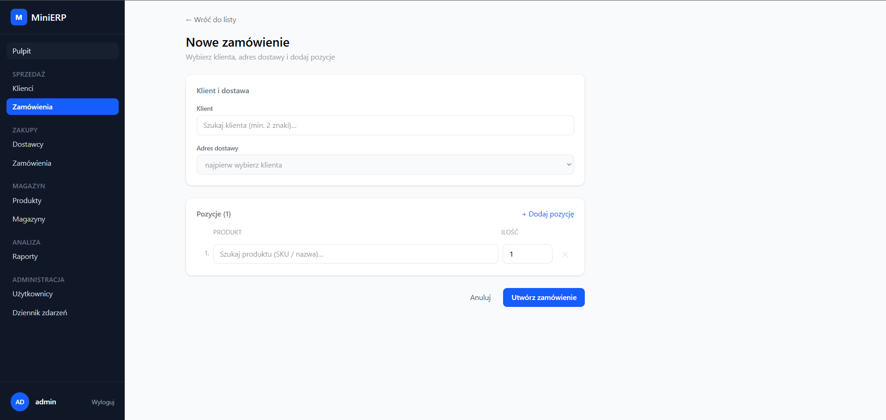

### Strona szczegółów
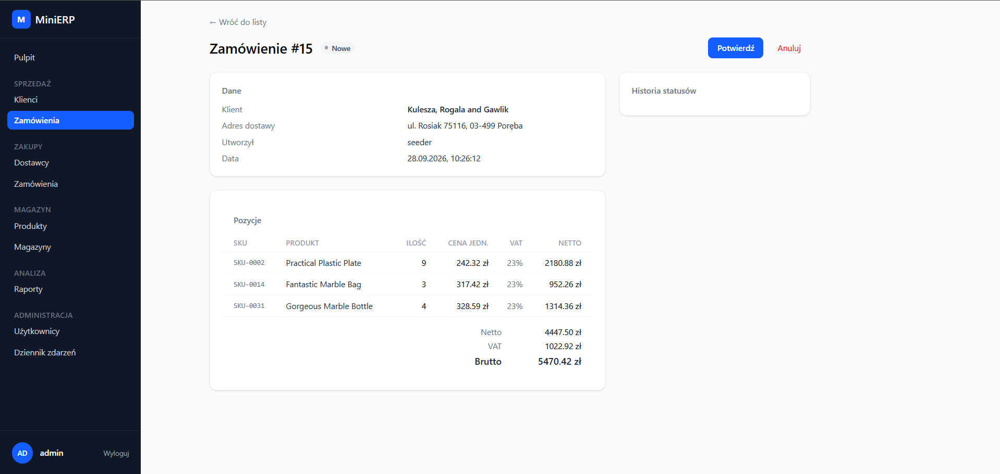

## 3.4. Zakupy

### Lista dostawców
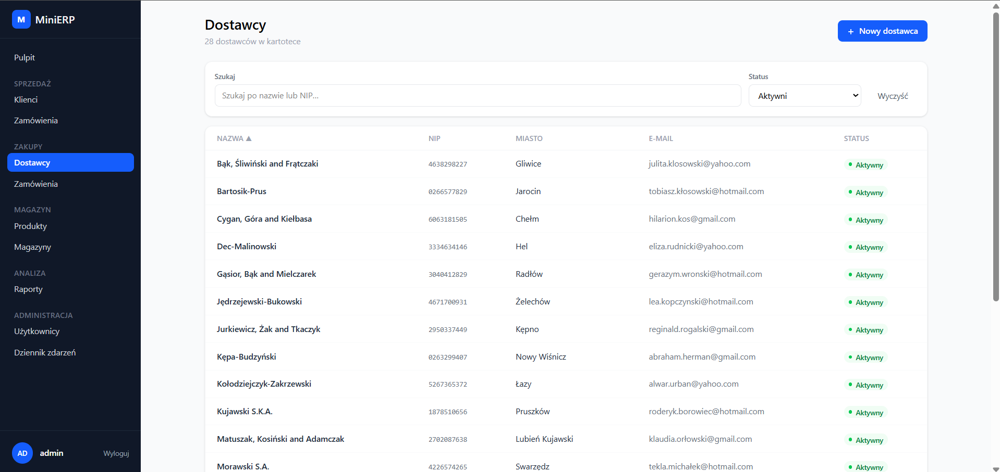

### Zamówienia do dostawców
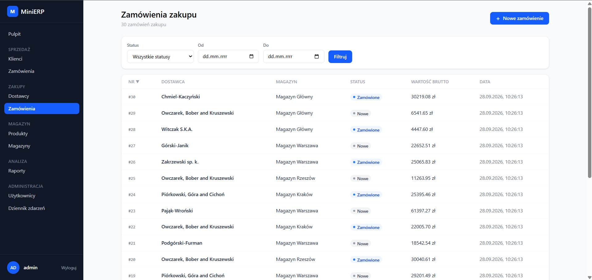

## Formularz dodawania dostawcy
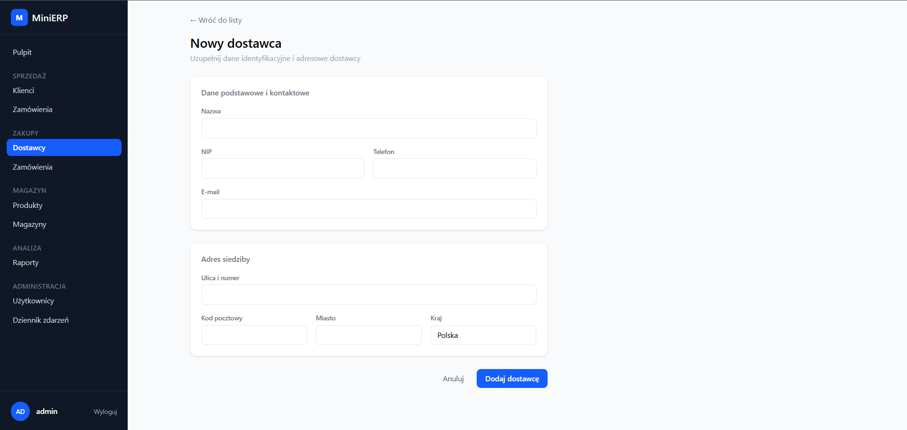

### Forumlarz dodawnia zamówienia
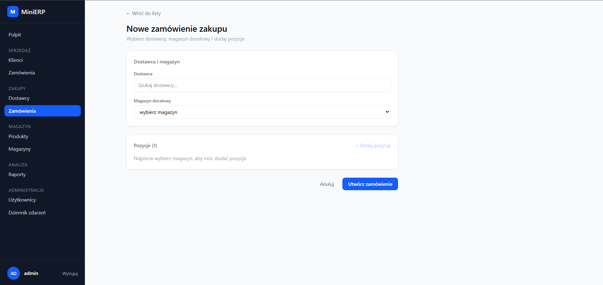

### Strona szczegółów
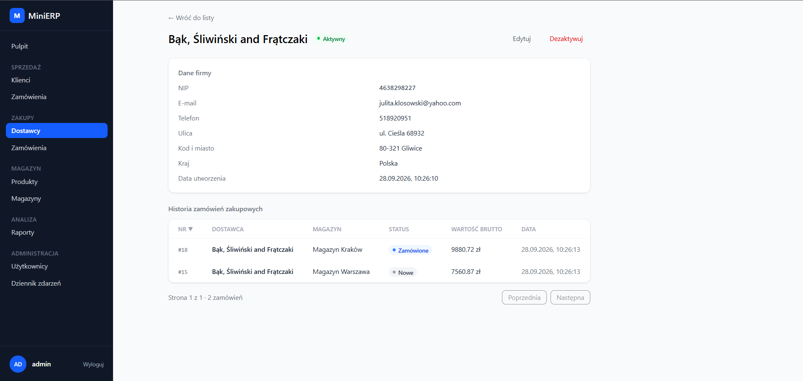

## 3.5. Magazyn

### Lista magazynów
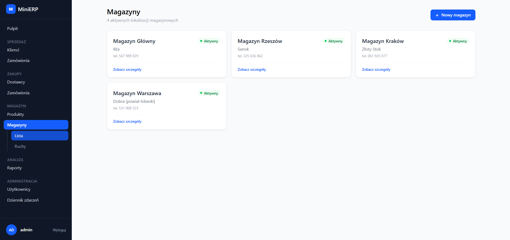

### Lista produktów
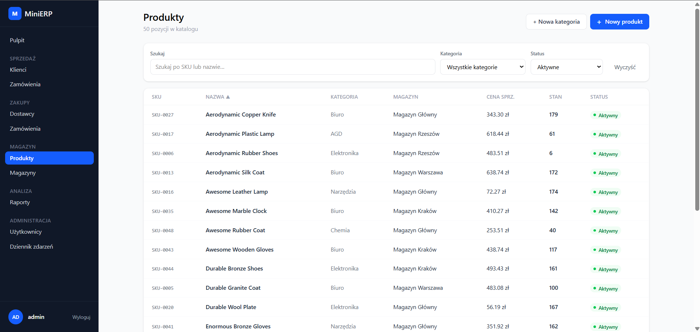

### Formularz dodawania produktu
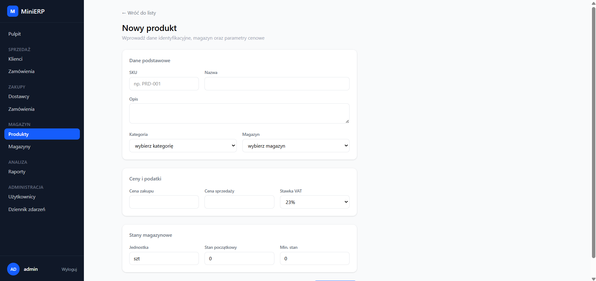


## Formularz dodawania magazynu
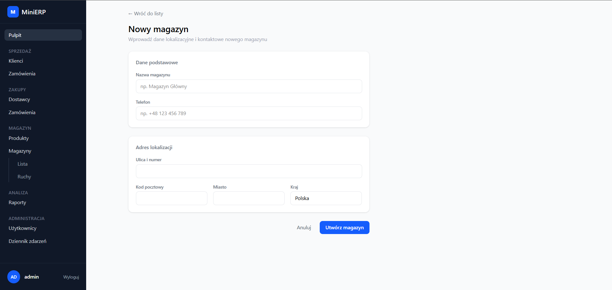

### Szczegóły magazynu
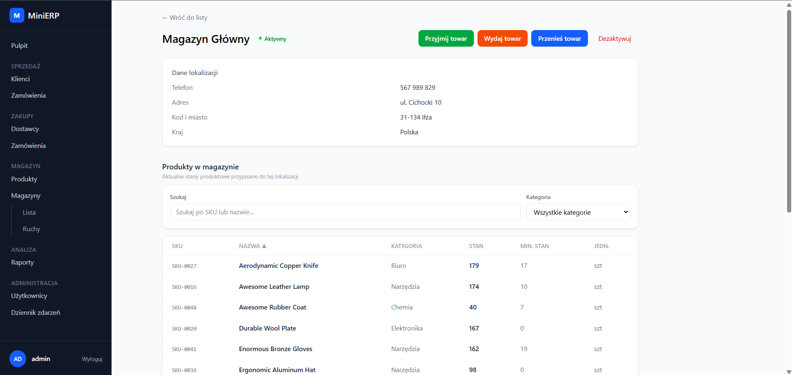

## 3.6. Raporty
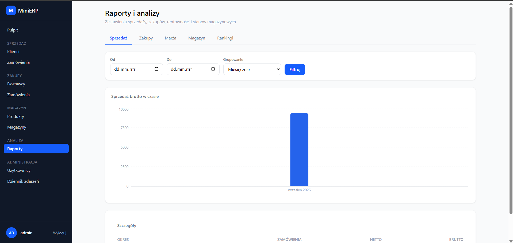

## 3.7. Audit log
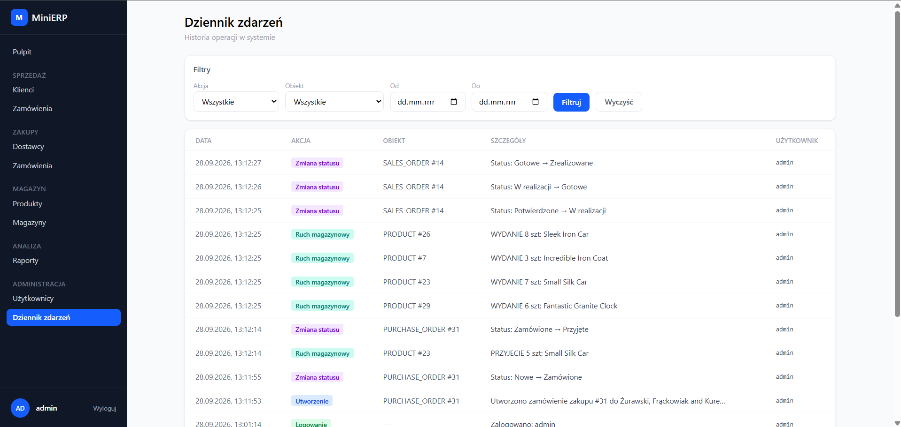

## 3.8. Zarządzanie użytkownikami
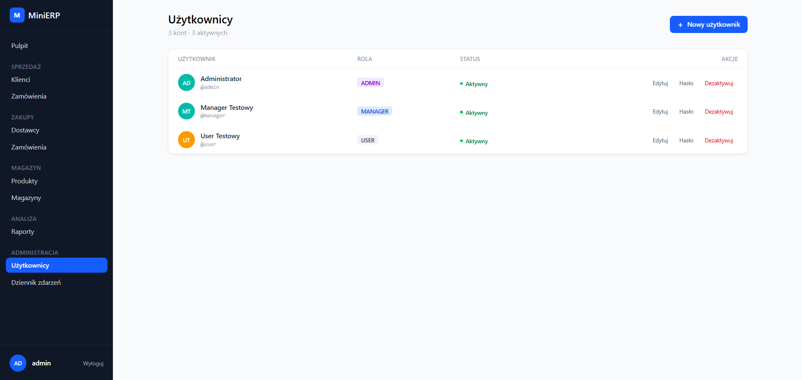

# 4. Architektura

## 4.1. Diagram encji

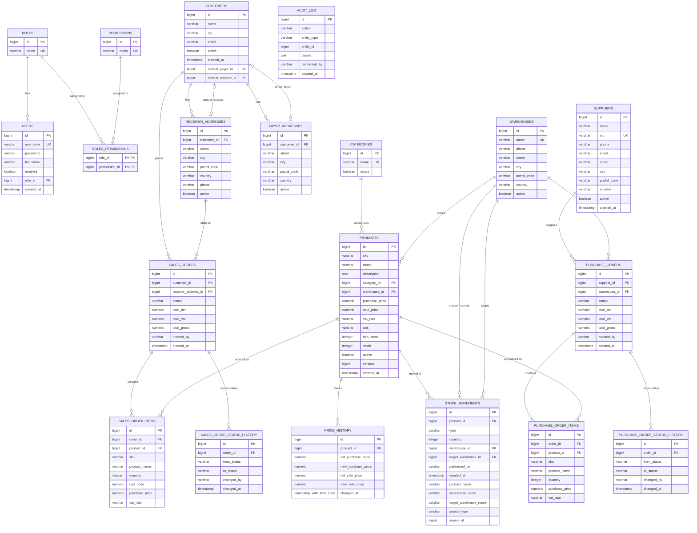


## 4.2. Backend

```text
com.mini_erp.backend
├── auth        – użytkownicy, role, uprawnienia, JWT, logowanie
├── catalog     – kategorie, produkty, historia cen, VatRate
├── customer    – klienci, adresy płatnika i odbiorcy
├── supplier    – dostawcy
├── warehouse   – magazyny, ruchy magazynowe, widok niskich stanów
├── sales       – zamówienia sprzedażowe
├── purchase    – zamówienia zakupowe
├── report      – raporty
├── dashboard   – podsumowanie na pulpit
├── audit       – dziennik zdarzeń
├── config      – SecurityConfig, OpenApiConfig
└── shared      – wyjątki, mappery MapStruct, DateRange
```
Każdy moduł ma tę samą strukturę warstw. Seedery danych testowych (`*Seeder` z profilem `dev`) leża w katalogu modułu

## 4.3. Frontend

```text
src
├── core/layouts/AppLayout.tsx    – rama aplikacji (boczne menu)
├── shared/
│   ├── components/               – Modal, ConfirmModal, ForbiddenPage, formStyles
│   └── services/                 – apiClient, auth
└── features/<moduł>/
    ├── components/  hooks/  schemas/  types/  views/
    └── route(s).tsx
```
Moduły frontendu to auth, dashboard, customers, suppliers, products, warehouses, sales, purchases, reports, users, audit. Router agreguje trasy z plików route.tsx poszczególnych modułów.

## 4.4. Uprawnienia

Użytkownik ma jedną rolę, a rola ma wiele uprawnień. Kązdy endpoint jest chroniony przez `@PreAuthorize("hasAuthority('...')")`. Brak tokena lub token nieprawidłowy daje 401, brak uprawnienia daje 403.

| Uprawnienie | ADMIN | MANAGER | USER |
| :--- | :---: | :---: | :---: |
| `PRODUCT_READ` / `CLIENT_READ` / `WAREHOUSE_READ` | ✓ | ✓ | ✓ |
| `SALES_READ` / `SALES_WRITE` | ✓ | ✓ | ✓ |
| `WAREHOUSE_OPERATE` (przyjęcie, wydanie, przesunięcie) | ✓ | ✓ | ✓ |
| `PRODUCT_WRITE`, `CLIENT_WRITE` | ✓ | ✓ | – |
| `SUPPLIER_READ` / `SUPPLIER_WRITE` | ✓ | ✓ | – |
| `PURCHASE_READ` / `PURCHASE_WRITE` | ✓ | ✓ | – |
| `WAREHOUSE_MANAGE` (CRUD magazynów, historia ruchów) | ✓ | ✓ | – |
| `REPORT_READ`, `AUDIT_READ` | ✓ | ✓ | – |
| `USER_MANAGE` | ✓ | – | – |

# 5. Uruchomienie

## 5.1 Konfiguracja

Sekrety są trzymane w pliku .env w katalogu głównym. Wzór znajduje się w .env.example. Minimalne zmienne to DB_NAME, DB_USER, DB_PASSWORD oraz dane konta administratora i sekret JWT. Dokładne nazwy są w .env.example.

## 5.2 Pełny stack w konterenach

`docker compose --profile full up -d --build`

- frontend: `localhost:3000`
- backend: `localhost:8080`
- Swagger UI: `localhost:8080/swagger-ui.html`

Frontend wywołuje API przez względne ścieżki. W kontenerze przekierowuje je nginx, w trybie dev proxy Vite

## 5.3 Tryb deweloperski

```
docker compose up -d postgres      # sama baza
cd backend && gradlew.bat bootRun  # backend na hoście
cd frontend && npm run dev         # frontend z hot reload
```
